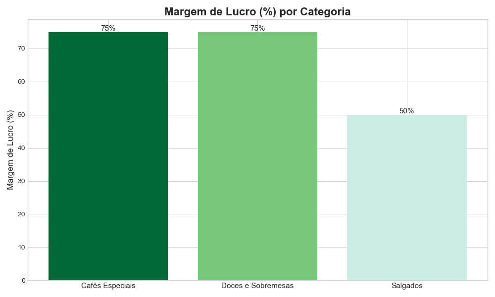

# 📊 Análise de Vendas - Cafeteria Café & Conexão

Análise de dados de vendas do último semestre da rede de cafeterias "Café & Conexão" para extrair insights e direcionar a estratégia de marketing da empresa.

## 📝 O Problema de Negócio

A diretoria da "Café & Conexão" precisa planejar o orçamento de marketing para o próximo semestre e precisa de uma recomendação baseada em dados sobre qual categoria de produtos (Cafés Especiais, Salgados ou Doces) deve receber maior investimento para maximizar a lucratividade.

## 💾 Fonte dos Dados

Os dados utilizados neste projeto são simulados e representam as vendas consolidadas do último semestre, incluindo métricas como receita, itens vendidos, custos e clientes únicos por categoria.

## 🚀 Tecnologias Utilizadas

* **Python 3.9**
* **Pandas:** Para manipulação e análise dos dados.
* **Matplotlib:** Para visualização e criação dos gráficos.
* **Jupyter Notebook:** Como ambiente de desenvolvimento para a análise.

## 🏃‍♀️ Como Executar o Projeto

1.  Clone este repositório: `git clone https://github.com/SEU-USUARIO/analise-cafeteria.git`
2.  Navegue até a pasta do projeto: `cd analise-cafeteria`
3.  Instale as dependências: `pip install pandas matplotlib`
4.  Abra o Jupyter Notebook: `jupyter notebook analise_cafe.ipynb`

## 💡 Análise e Principais Descobertas

A análise foi focada em métricas de desempenho, rentabilidade e eficiência para entender a fundo a contribuição de cada categoria.

### Principais Métricas
A tabela final com todos os cálculos pode ser vista abaixo:
| Categoria          | Receita Total | Lucro Bruto | Margem de Lucro (%) | Ticket Médio |
|--------------------|---------------|-------------|---------------------|--------------|
| Cafés Especiais    | R$ 120.000    | R$ 90.000   | 75%                 | R$ 15,00     |
| Doces e Sobremesas | R$ 65.000     | R$ 48.750   | 75%                 | R$ 12,50     |
| Salgados           | R$ 95.000     | R$ 47.500   | 50%                 | R$ 8,00      |

### Descobertas Visuais

**1. Lucro Bruto:** A categoria de **Cafés Especiais** é a que mais gera lucro absoluto para a empresa, sendo o principal motor financeiro.

[analise-cafe-conexao.ipynb](https://github.com/user-attachments/files/22413026/analise-cafe-conexao.ipynb)

## 🎯 Recomendação Estratégica

Com base na análise, a recomendação é **focar os investimentos de marketing na categoria de "Doces e Sobremesas"**.

**Justificativa:** Esta categoria possui uma margem de lucro tão alta quanto a de cafés (75%), mas sua receita e lucro bruto ainda são baixos. Isso indica um enorme potencial de crescimento. Uma campanha focada em combos ("café + doce") ou na promoção de sobremesas pode aumentar o volume de vendas e, devido à alta eficiência, gerar um retorno sobre o investimento muito significativo.

## ✒️ Autor

* **[Seu Nome]**
* **LinkedIn:** [https://www.linkedin.com/in/seu-linkedin/](https://www.linkedin.com/in/seu-linkedin/)
* **GitHub:** [https://github.com/SEU-USUARIO](https://github.com/SEU-USUARIO)
